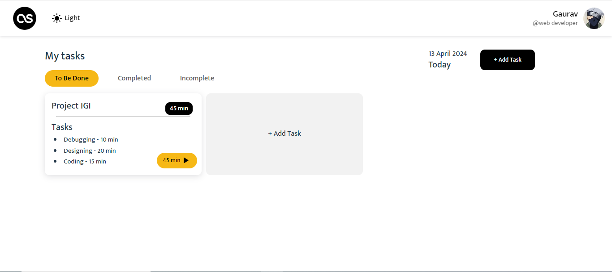
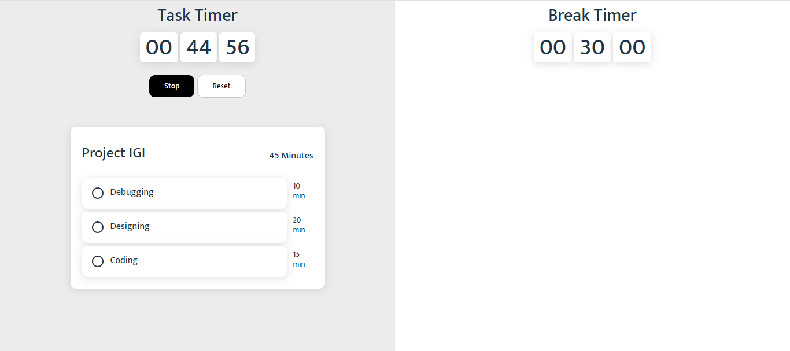
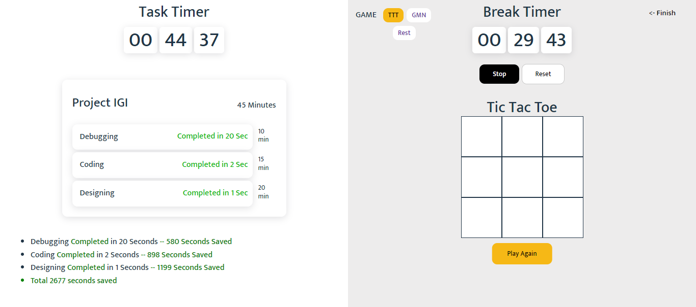
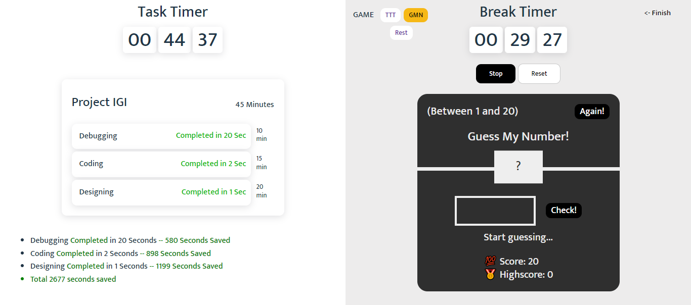
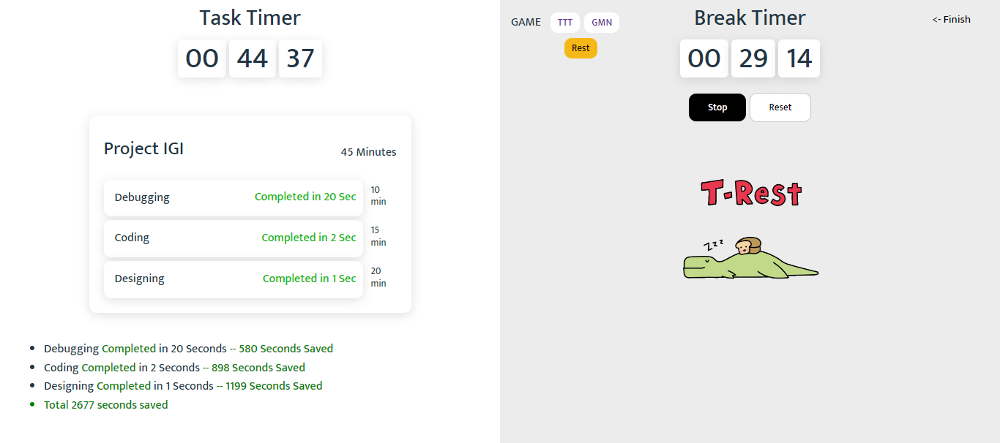
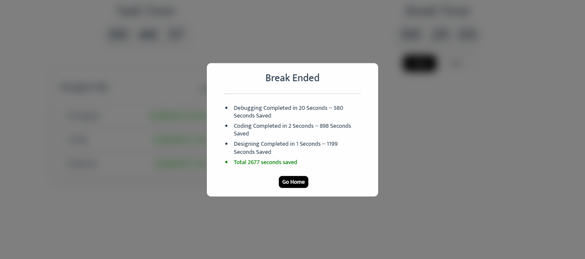
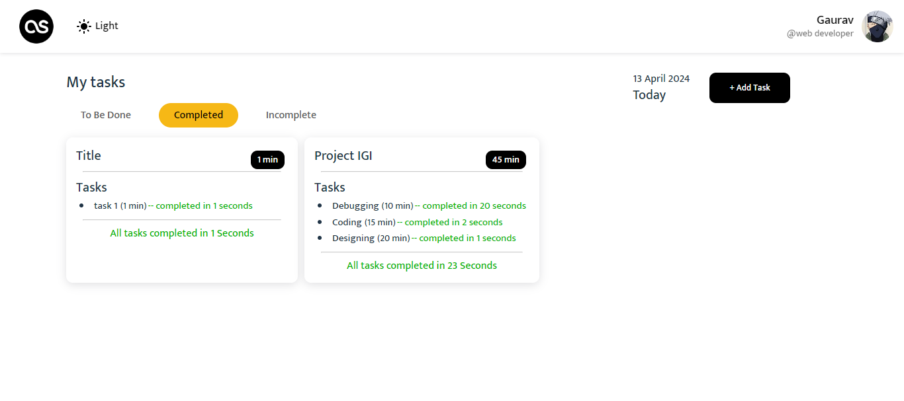
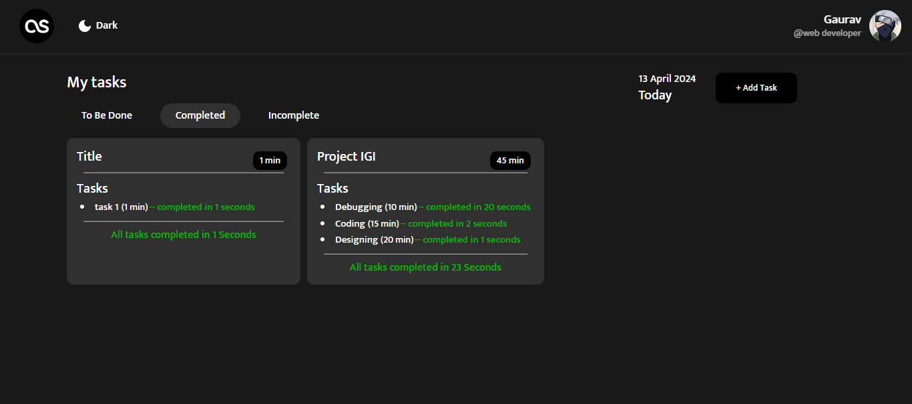
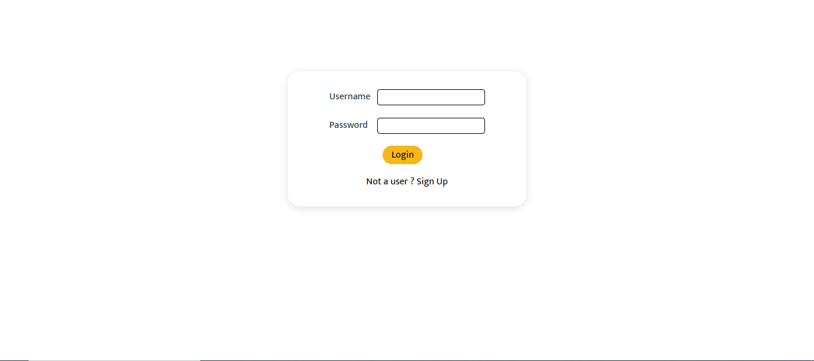

# Pomodoro

Pomodoro is a task management app based on the task and break timers which lets you do work efficiently while keeping track of the time.

 

 

 

## Objectives

- Managing time and work.
- Keeping track of the routine and history.
- Enjoying games while on break.

## Not Getting Started

This app is not publically available to run. if you still want to try it then you must have a database hosted or change the code after cloning.

**User Interactions:**

- Add a new Task Group.
- View Completed, Incomplete and To be done task groups.
- Initiate a timer for a task group.
- Play Guess My Number game on break timer.
- Switch Dark/Light Mode
